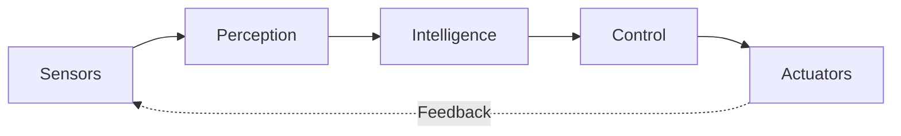

# DUCXTERITY

### Mạnh Đức · Robotics & Artificial Intelligence

**Engineering intelligence through perception, decision, and motion.**

Robotics & AI student at [HUMG](https://humg.edu.vn/) · Exploring ROS 2, computer vision and embedded systems

## About Me

I'm **Mạnh Đức**, a student of **Robotics and Artificial Intelligence** at the **Hanoi University of Mining and Geology**.

I am learning how intelligent machines perceive their surroundings, make decisions, and interact reliably with the physical world. My goal is to connect software, AI, electronics, and control into complete robotic systems.

## The Robotics Loop

## Current Focus

| Domain | What I'm exploring |
| --- | --- |
| **Perception** | Computer vision · Object detection · Sensor fusion |
| **Intelligence** | Machine learning · Path planning · Decision-making |
| **Motion** | Robot kinematics · Control systems · Autonomous navigation |
| **Hardware** | Embedded programming · Sensors · Microcontrollers |

## Technology Stack

### Languages

### Robotics & AI

### Engineering Tools

## GitHub Activity

---

### Sense. Understand. Decide. Act.

Engineering intelligence with Ducxterity.

